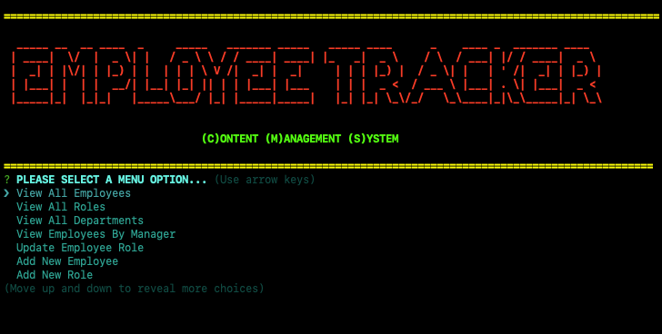

# MySQL-Employee-Tracker

## Task

To build a command-line application from scratch to manage a company's employee database, using Node.js, Inquirer, and MySQL.

## User Story

AS A business owner
I WANT to be able to view and manage the departments, roles, and employees in my company
SO THAT I can organize and plan my business

## Acceptance Criteria

GIVEN a command-line application that accepts user input
WHEN I start the application
THEN I am presented with the following options: view all departments, view all roles, view all employees, add a department, add a role, add an employee, and update an employee role
WHEN I choose to view all departments
THEN I am presented with a formatted table showing department names and department ids
WHEN I choose to view all roles
THEN I am presented with the job title, role id, the department that role belongs to, and the salary for that role
WHEN I choose to view all employees
THEN I am presented with a formatted table showing employee data, including employee ids, first names, last names, job titles, departments, salaries, and managers that the employees report to
WHEN I choose to add a department
THEN I am prompted to enter the name of the department and that department is added to the database
WHEN I choose to add a role
THEN I am prompted to enter the name, salary, and department for the role and that role is added to the database
WHEN I choose to add an employee
THEN I am prompted to enter the employee’s first name, last name, role, and manager, and that employee is added to the database
WHEN I choose to update an employee role
THEN I am prompted to select an employee to update and their new role and this information is updated in the database

## What the finished product should look like 


## Installation 

Open `terminal` window after fork.

`npm init -y` to create a package.son file to store your dependenices. 

`npm i` to install your NPM package manager and required dependencies.

`npm i inquirer` to interact with the user via the command-line.

`npm i figlet` to implement FIGfont spec in Javascript. 

`npm i chalk ` for terminal string styling of Logo.

`npm i console.table` to print MySQL rows to the console.

`npm i dotenv` to store environmental variables.

`npm i mysql2` to connect to your MySQL database and perform queries.

run command `mysql -u -root -p` to initilize MySQL, then type `username` and `password` to login:

```
Test User

username: root
password: test123
database: employeeTracker_db

 ```
`Welcome to the MySQL monitor` 

type `mysql> status` to confirm connection with database.

run command `node employeeTracker`, or `npm start` to answer the prompts.

## Usage

run command `npm start` 

select an option from the menu prompt 

follow the prompts for each selection.

`Red` menu options are unfinished `Bonus`.

Select `Exit Menu` to quit.

## What the finished product should look like 




